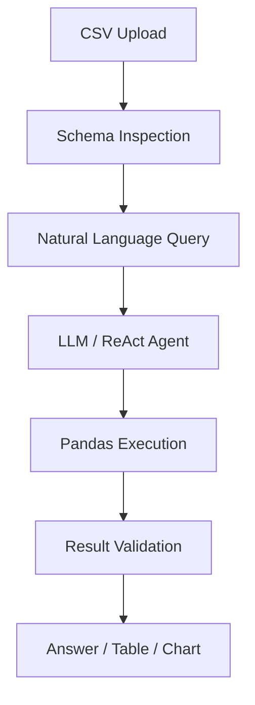

<div align="center">
  
# 📊 DataWhisperer

### Talk to your data in plain English.
AI-powered CSV analysis using natural language.

[🚀 **Live Demo**](https://data-whisper-manoj-7kpjznwt7ycm4fbbxrgxv8.streamlit.app/) | [📂 **GitHub**](https://github.com/manojperi26/data-whisper)

</div>

DataWhisperer lets users upload a CSV and ask questions about their data using natural language. It generates and executes Pandas analysis, validates results, and returns answers, tables, and visualizations.

## Key Features
- Natural-language data analysis
- Schema-aware LLM reasoning
- Automatic Pandas code generation and execution
- Tables and visualizations
- Reliability checks for common LLM analysis errors
- Groq → Ollama fallback
- Conversation-aware follow-up questions
- Streamlit interface

## Example Questions
- "Who are the top 5 players by runs?"
- "Show the monthly revenue trend."
- "Which category has the highest average sales?"
- "Create a chart of revenue by region."

## Architecture



## Reliability
DataWhisperer includes safeguards against common LLM data-analysis failures:
- Incorrect aggregation scope
- Hallucinated column names
- Filter-after-aggregate mistakes
- NaN handling
- dtype mismatches
- Incorrect sorting
- Empty-result detection
- Chart generation failures
- DataFrame mutation
- Tie handling
- Follow-up context

## Tech Stack
Python · Pandas · LangChain · Groq · Ollama · Matplotlib · Streamlit

## Run Locally

```bash
git clone https://github.com/manojperi26/data-whisper.git
cd data-whisper
pip install -r requirements.txt
```

Create a `.env` file in the root directory and add your API key:
```ini
GROQ_API_KEY="your_api_key_here"
```

Start the application:
```bash
streamlit run app.py
```

## Project Structure
```text
data-whisper/
├── app.py
├── style.css
├── test_reliability.py
├── requirements.txt
├── notebooks/
│   └── DataWhisperer.ipynb
└── README.md
```
